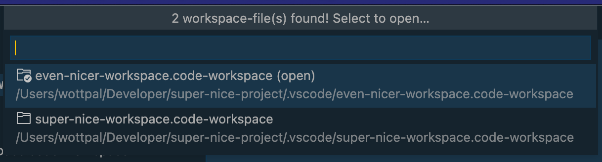

# VSCode Extension: Auto-Open Workspace

VSCode Extension that checks the active directory for `*.code-workspace` files when opening a folder and automatically opens it.

It can also be manually invoked via the `auto-open-workspace.open-workspace-file` command.

Read more about VSCode Workspaces and how they work [here](https://code.visualstudio.com/docs/editor/workspaces).




## Installation

I will release the extension to the VSCode Marketplace soon, until then download the [latest release](https://github.com/wottpal/vscode-auto-open-workspace/releases) and execute:

```bash
code --install-extension vscode-auto-open-workspace-0.0.1.vsix --force 
```


## Extension Settings

This extension contributes the following settings:

* `autoOpenWorkspace.enableAutoOpenIfSingleWorkspace`: Automatically open workspace-file (if only one was detected). Select menu is shown otherwise. (defaults to `true`)
* `autoOpenWorkspace.enableAutoOpenAlwaysFirst`: Always automatically open first detected workspace-file. (defaults to `false`)


## Release Notes

### 0.0.2

Add options to automatically open (first) detected workspace-file.

### 0.0.1

Initial Release